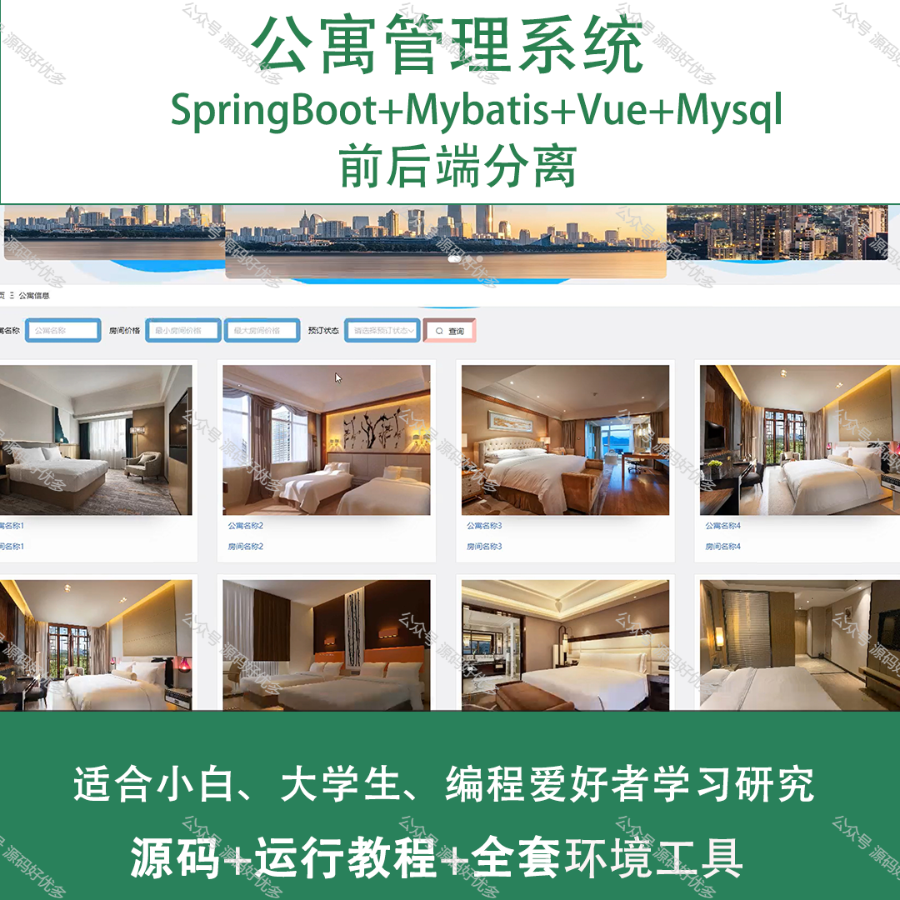
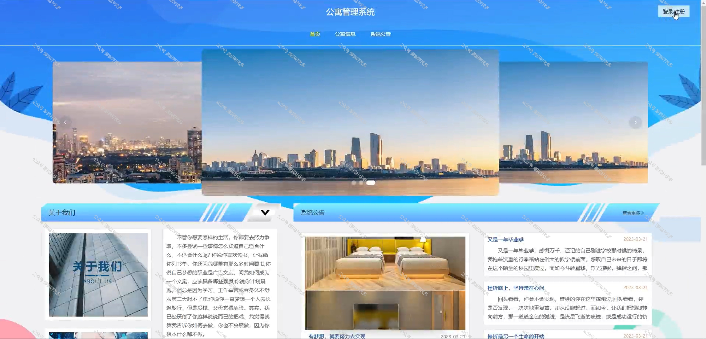
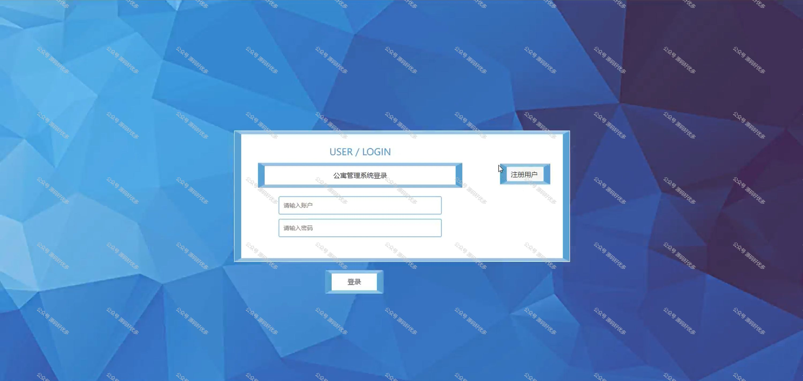
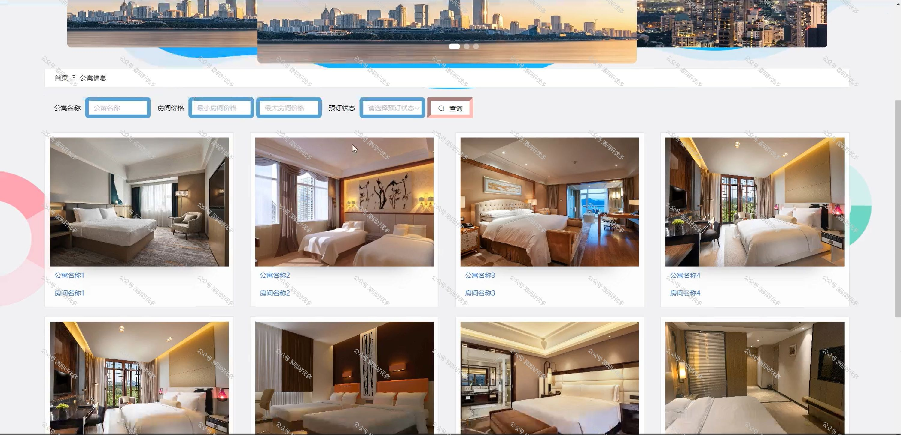
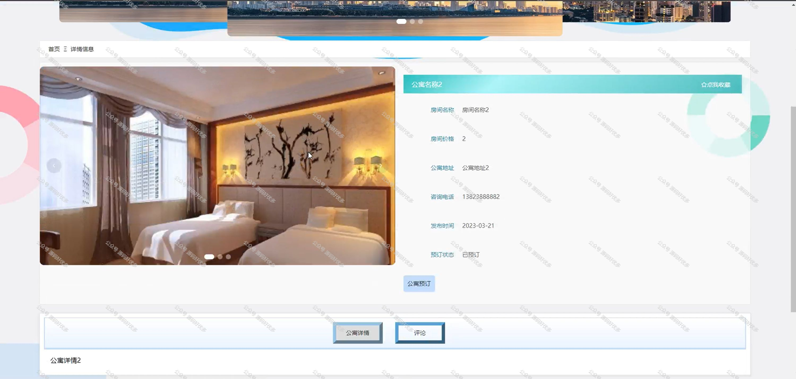
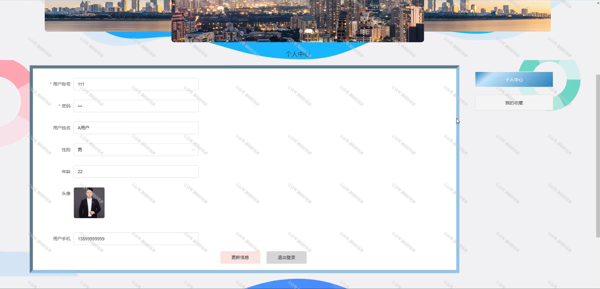
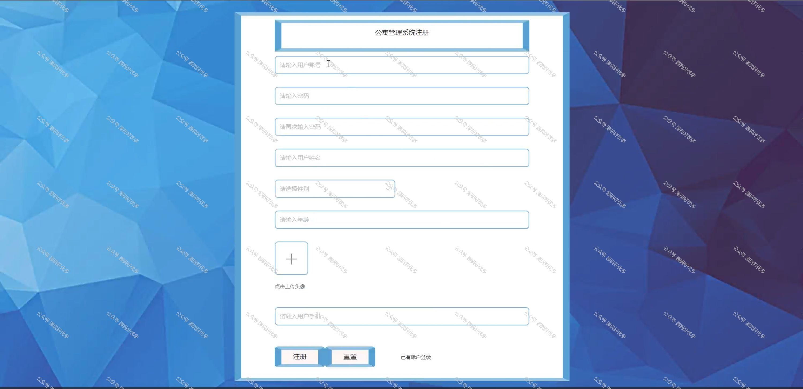
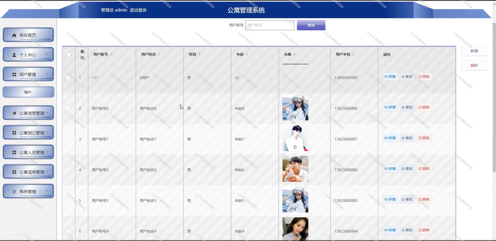
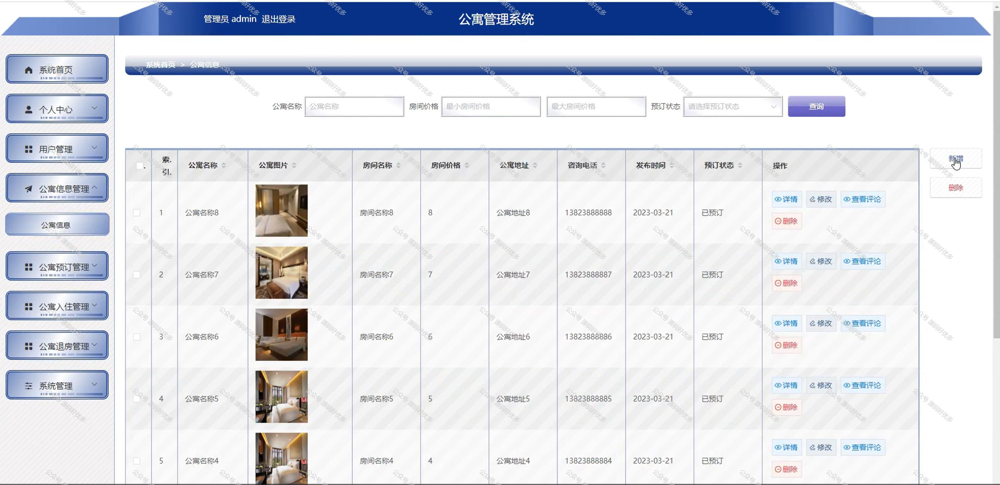
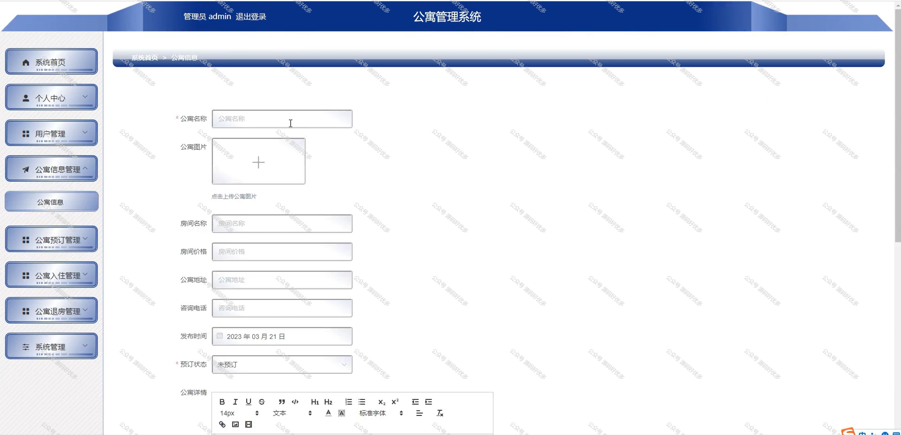

 
## 查看主页获取源码

### 一、作品包含

源码+数据库+全套环境和工具资源+部署教程

### 二、项目技术

前端技术：Html、Css、Js、Vue、Element-ui

数据库：MySQL

后端技术：Java、Spring Boot、MyBatis

  

### 三、运行环境

开发工具：IDEA/eclipse

数据库：MySQL5.7

数据库管理工具：Navicat10以上版本

环境配置软件： JDK1.8+Maven3.6.3

前端Nodejs：14

### 四、项目介绍
项目编号：springbootA183

随着城市化进程的加快和人口流动性的增加，公寓作为城市居住的重要形式，其管理效率和服务质量直接关系到居民的生活品质。公寓管理系统的研究与开发，旨在通过信息化手段，提高公寓管理的智能化水平，从而提升公寓管理的效率，增强住户的居住体验，推动社区管理的现代化进程。

前台用户功能：首页、公寓信息、系统公告、个人中心。

后台分为管理员和用户
管理员的功能：系统首页、个人中心、用户管理、公寓信息管理、公寓预订管理、公寓入住管理、公寓退房管理、系统管理。
用户的功能：系统首页、个人中心、公寓预订管理、公寓入住管理、公寓退房管理。

### 五、运行截图

  
